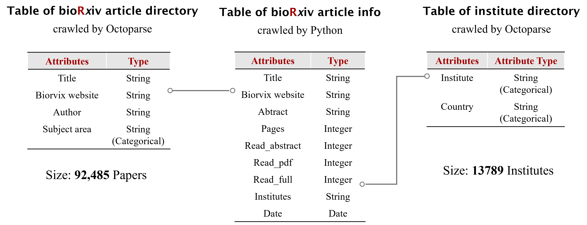
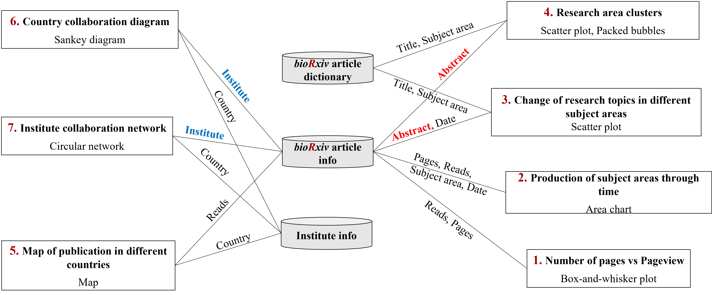

# Analysis of research on biorxiv

This project crawls the authors, institutes, abstract, uploading date, influence, and length of all the papers on Biorxiv by September 9th, 2021.

In this project, we aim to find out the characteristics of articles on BioRxiv by finishing the following six goals:

**1. The number of pages** 
Explore the relationship between the number of pages of an article and its views.

**2. Website usage** 
Discover the trend of website usage, such as publication and reading since 2014.

**3. Correlation between subject areas** 
Find the overlap between the discussed topics in different subject areas.

**4. Hot topics among all articles** 
Analyze possible correlations between the issues discussed in each piece.

**5. A country’s academic performance** 
Evaluate the academic performance (productivity and influence) of the countries worldwide.

**6. Collaboration among institutes and countries** 
Find the countries and institutes with active cooperation.

## Data cralwing and dataset construction

## Visualizations

**1. Nubmer of pages vs views** 
This visualization is a box plot, which shows that there is no obvious relationship between the page number of an article and its views. In bins 0-30, there is an outlier with 0 page. It turns out that the website withdraws this paper after its claim that 2019-CoV has similar inserts as HIV is proved to be spurious. A box plot displays various statistical properties of the data effectively, but in this case the trend is hard to read because of the outlier.  

**2. Production of subject areas through time** 
It is an area chart, which uses the hue color channel to represent different subject areas. This visualization shows the trend of website usage overall and that of each subject area. The number of publications increases in all subject areas over the years. In 2014, neuroscience is the hottest topic, and it gains attention again in 2021. We also see a surge in full text reading in epidemiology and evolutionary biology in 2020, which could attribute to the COVID-19 pandemic. 

**3. Change of research topics in different subject areas** 
The third is a scatter plot with each article denoted as a dot, and we can observe some apparent overlaps among subjects. For example, bioengineering and biophysics, genetics and genomics have strong overlaps. Clicking or filtering different pairs of subject area is really effective for analyzing correlations. 

**4. Research area clusters** 
In this visualization, based on the scatter plot, we used DBScan for topic clustering and we select the top 5 frequent words. The topic for each group is sexual behavior, virus, plants, guts/ Animals, DNA, COVID-19, social behaviors, cell and immunology, protein, plants roots and cells and brain. 

**5. Map of publication in different countries** 
As shown in the fifth map, the saturation of color represents the number of publications produced by this country. The deeper the color, the more the papers. We find that USA produced the most academic paper, while it is the articles from Botswana in Africa that have the most reads. The time bar can be dragged to show development in different periods, and such interaction helps integrate more information into one visualization. 

**6. Country collaboration diagram** 
The sixth is a Sankey diagram that shows collaboration between some academically active countries.  Here, the wider the band, the more cooperation there is between the two countries. Since the most significant out-flow comes from US and UK, they are the most collaborative countries. For a Sankey diagram, though it lacks geographic information, it displays country relationship vividly. 

**7. Institute collaboration network** 
The last plot is a network in circular layout, where each node denotes an institute, and each edge represents a collaboration relationship. The size of nodes is mapped from its degree, and the width of the edges is mapped from its amount of cooperation. From this graph, we know that USC is the most active collaborator. Since the widest edge connects USC and UCB, they are the most active academic partner. Moreover, we use the color channel to encode an institute’s country, which shows that most active collaborators come from the US. 
